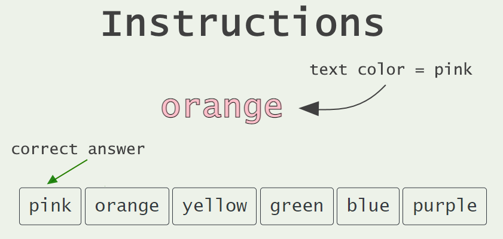
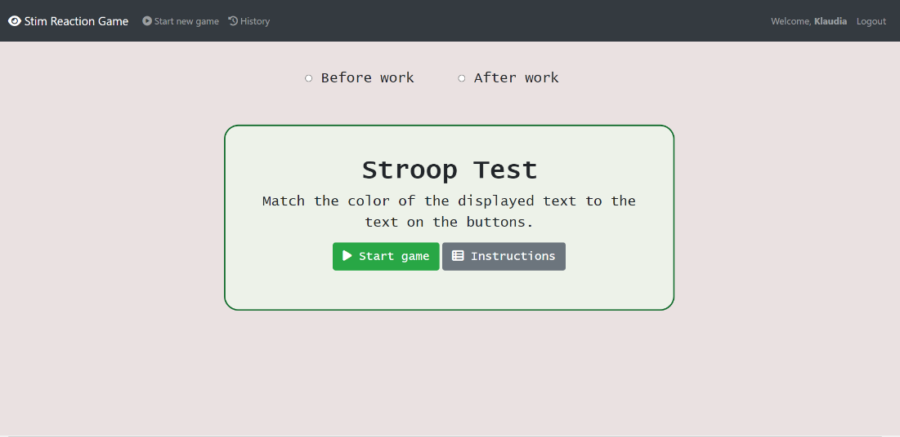
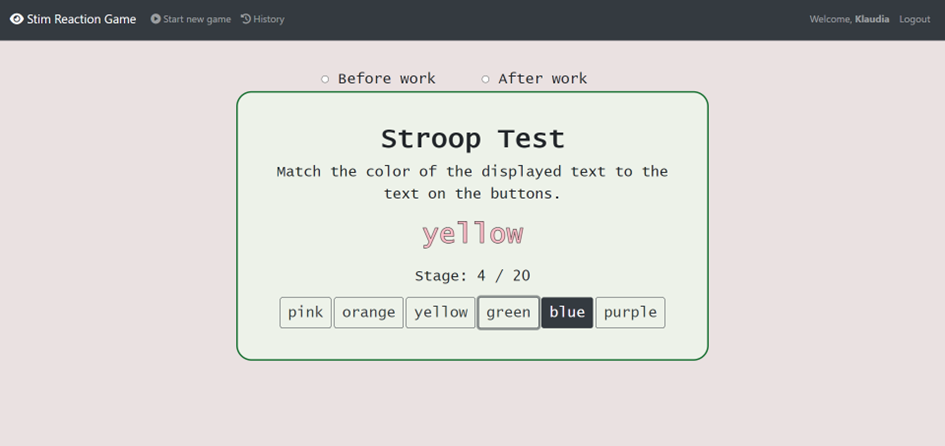
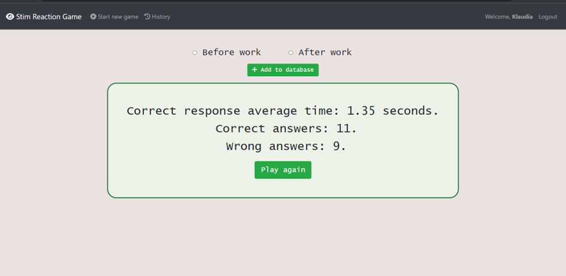
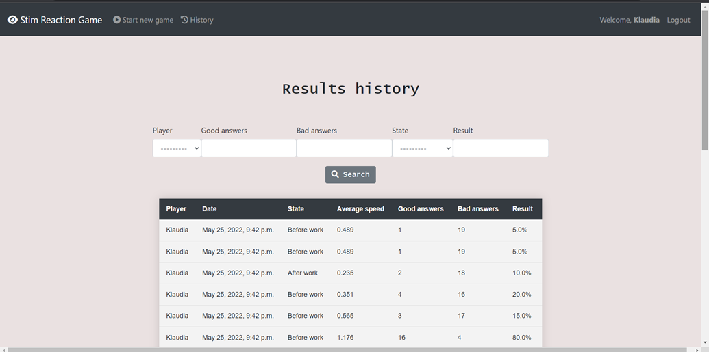
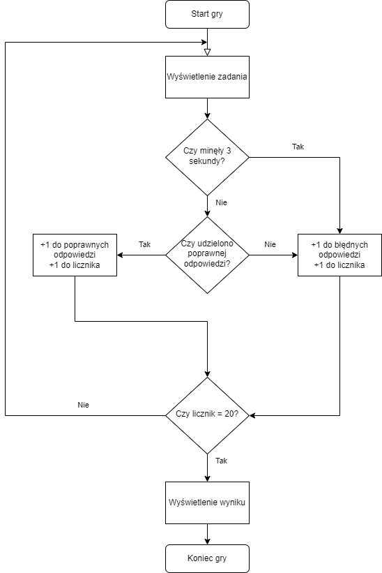
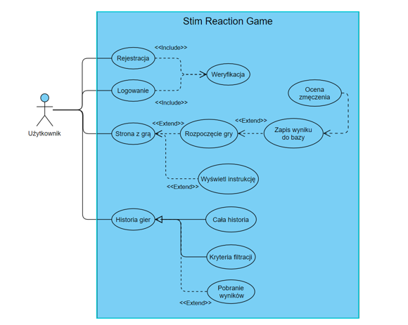
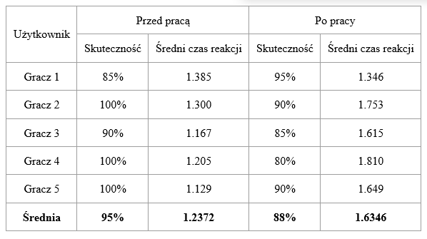

# stim-reaction-game

This project was completed as credit for the Fundamentals of Telemedicine classes. 
#### Contribution
[@Swedeling](https://github.com/Swedeling) - Project Manager, Tester, Django support  
[@BZiolkow](https://github.com/BZiolkow) - problem analysis, Django support  
[@izabelawilusz](https://github.com/izabelawilusz) - UX/UI Designer  
[@AlSzmigiel](https://github.com/AlSzmigiel) - problem analysis, Django Developer  
[@SzymonBuch](https://github.com/SzymonBuch) - JavaScript and Django Developer  
[@chickorita](https://github.com/chickorita) - JavaScript and Django developer  
## Introduction

The increasing attention paid to the efficiency of performed work and the high number of accidents at work has led 
to a search for a work capability assessment solution. We propose a simple game based on 
the Stroop effect, which estimates the fatigue level of the user based on 
the reaction time. 

## Stroop effect

In psychology, the Stroop effect is the delay in reaction time between congruent and incongruent stimuli.
The effect has been used to create a psychological test (the Stroop test) that is widely used in clinical practice and investigation.

A basic task that demonstrates this effect occurs when there is a mismatch between the name
of a color (e.g., "blue", "green", or "red") and the color it is printed on 
(i.e., the word "red" printed in blue ink instead of red ink). When asked to name the 
color of the word it takes longer and is more prone to errors when the color of the ink 
does not match the name of the color.

Graphically it can be represented as below: 

    

        
    

## Game 

    

        
    

    

        
    

    

        
    

    

        
    

    

        
    

## Game Flow

    

        
    

## UML

    

        
    

## Results

    

        
    

## Summary
<li> the game allows the measurement of reaction time to a stimulus </li>
<li> the game allows the measurement of reaction time to a stimulus </li>
<li> tests show increased reaction time after working in front of a computer </li>

## What's next?
<li> making the game available on an online server </li>
<li> saving the results into a database allows their analysis </li>
<li> further incentives can be introduced </li>

## Files
- [Final Presentation](https://github.com/Swedeling/stim-reaction-game/blob/main/Final%20presentation%20-%20StimReactionGame.pdf) - short ppt presentation with introduction, tools, results and summary (in Polish) </li>
- [Final Report](https://github.com/Swedeling/stim-reaction-game/blob/main/Final%20Report%20-%20StimReactionGame.pdf) - project description and documentation (in Polish)
